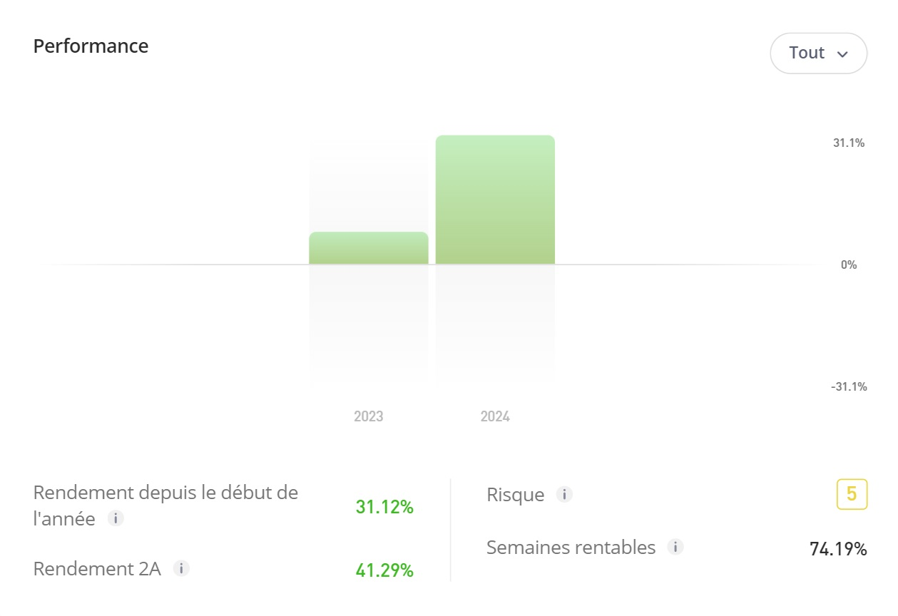

# Welcome

  

Welcome to the site! Our goal is to provide insights and detailed analysis of financial performance, investment strategies, and risk management. We aim to help both novice and experienced investors make informed decisions based on comprehensive data and expert analysis.

## Performance Overview

  

The performance chart above showcases the investment growth and risk management strategies implemented over the years. It highlights the annual performance for 2023 and 2024, demonstrating significant growth and effective risk mitigation.

## Our Mission

We strive to empower our users with the knowledge and tools they need to succeed in the financial markets. Whether you're looking to understand market trends, analyze investment opportunities, or manage risks, our platform provides the resources and guidance you need.

## Learn More

For more detailed insights and to follow our investment strategies, visit our [eToro profile](https://www.etoro.com/people/mtsfju).

---

Thank you for visiting our site. We hope you find the information useful and informative. If you have any questions or need further assistance, feel free to contact us.
